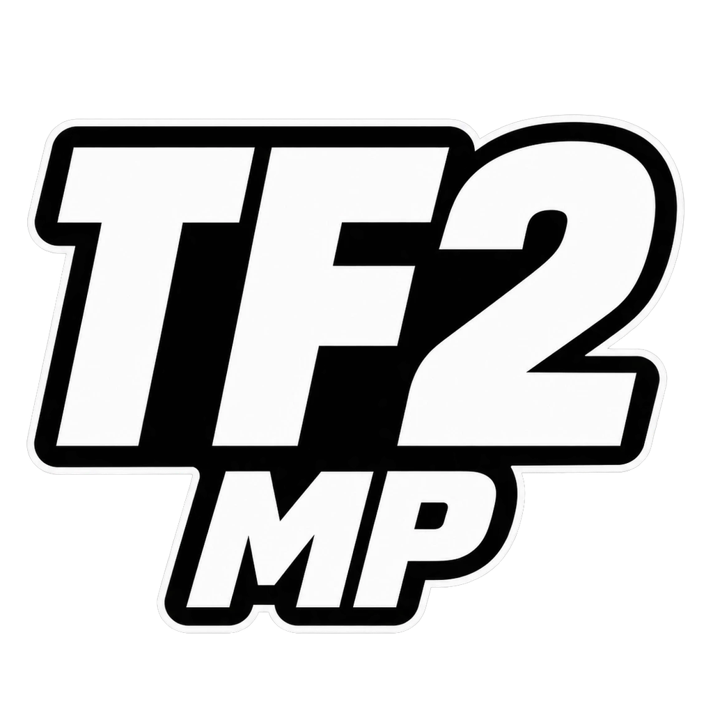
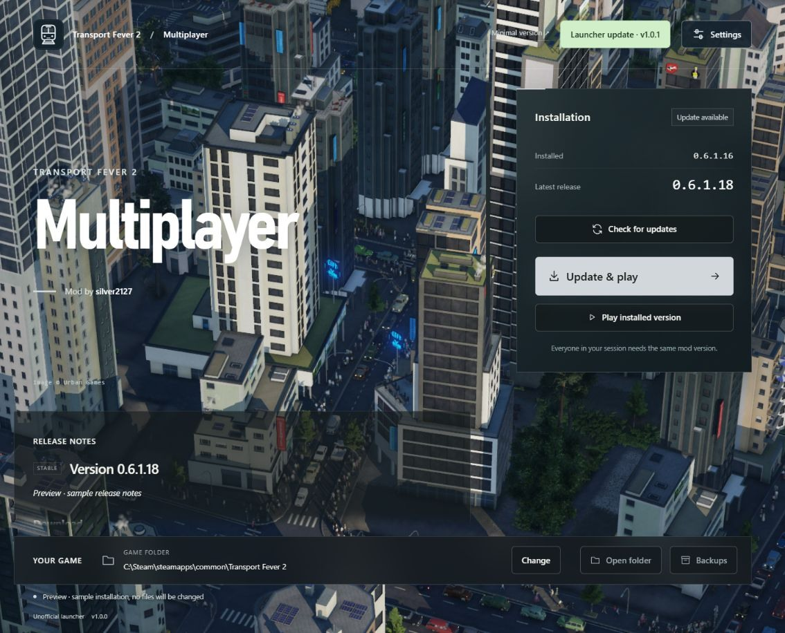

<div align="center">
  
  <h1>TPF2 Multiplayer Launcher</h1>
  <p>Install, update and play <a href="https://github.com/silver2127/tpf2-multiplayer">Silver’s multiplayer mod</a> for Transport Fever 2.</p>
  <p>
    <a href="https://github.com/tearded/tpf-multiplayer-launcher/releases/latest"><strong>Download for Windows</strong></a>
    &nbsp; · &nbsp;
    <a href="https://github.com/tearded/tpf-multiplayer-launcher/releases">Release notes</a>
    &nbsp; · &nbsp;
    <a href="https://github.com/tearded/tpf-multiplayer-launcher/issues">Report an issue</a>
  </p>
  <p><sub>Windows 10 / 11 · Linux (native or Proton) · 64-bit · English</sub></p>
</div>



<p align="center"><sub>Version 1.1.0 browser preview with sample data and a simulated launcher update to 1.1.1. Release notes and mod versions are examples; the desktop launcher displays the original GitHub release text. City image © Urban Games.</sub></p>

## Get in game

Download **Setup.exe** from the [launcher releases](https://github.com/tearded/tpf-multiplayer-launcher/releases/latest). The installer runs for the current Windows user and installs WebView2 if needed.

Requirements: Windows 10/11 x64, Steam, and Transport Fever 2 Steam build 35924. Downloads require an internet connection.

1. Check the detected game folder, or select it with **Change**.
2. Click **Install multiplayer** or **Update & play**. The launcher verifies the download, backs up the current mod files, installs multiplayer and starts the game through Steam.
3. Everyone in a multiplayer session must use the same mod version.

When GitHub is unavailable, an installed multiplayer version can still be started.

### On Linux

Download the **.AppImage** from the same release, make it executable (`chmod +x`) and start it. It works for both ways Linux runs Transport Fever 2:

- **Native** (Steam's Linux build): the launcher installs the release's Linux package with its own `install.sh`, which adds a small preload block to the game's `run.sh`, so no Steam launch options are needed. A Steam update or file check restores `run.sh`; **Play** puts the block back from the downloaded release before starting the game.
- **Proton** (the Windows build): the launcher installs the release's Proton files with its `install_proton.py`, which needs `python3`.

**Settings > Game type** picks which one to install for: *Automatic* follows how Steam runs the game. To switch, choose the type here and change **Properties > Compatibility** in Steam; the launcher shows what Steam still needs and waits until Steam has switched and downloaded that build. Native, Snap and Flatpak Steam are all found, in every Steam library. Downloaded packages are kept in `~/.local/share/tpf2mp-launcher/Downloads` (the backup limit in Settings applies to them).

## What it does

| Feature | What you can do |
| :--- | :--- |
| **Install & play** | Verify the package, back up the current mod, install Silver and launch through Steam. |
| **Stable or Experimental** | Choose your release track in Settings. Experimental installs ask for confirmation. |
| **Previous releases** | Click **Install a different version** to browse release history and install an older, verifiable version when your group needs it. |
| **Remove multiplayer** | Uninstall the mod from Settings. The original game files are restored; saves, other mods and backups are kept. |
| **Backups you control** | Keep 1, 3, 5, 10 or unlimited historical backups. Five is the default. |
| **Separate update checks** | Check both the multiplayer mod and the launcher. Launcher updates appear in Settings and install only when you choose. |
| **Recovery** | Restore managed mod files after an interrupted installation. Saves and unrelated mods are preserved. |

## A few useful details

<details>
<summary><strong>Release history and older versions</strong></summary>

Click **Install a different version** below the play buttons, or expand **Release history** below the current patchnotes, to browse older Silver releases for the selected track, with dates and original notes. **Load more releases** retrieves the next page. Each release can be installed after confirmation; the latest available version remains displayed separately. Historical packages must pass the same checksum, source and compatibility checks, so some old releases without verifiable packages cannot be installed.

</details>

<details>
<summary><strong>What is backed up and cleaned up</strong></summary>

Settings offers 1, 3, 5 (default), 10, or unlimited historical profile backups. The preference is stored locally and cleanup runs after the next successful mod installation, not when the selection changes. Only the active profile is retained separately; cached historical versions count toward the limit. Cleanup is skipped entirely while recovery is pending; unknown or linked folders are not removed. Completed downloaded MSI packages are removed after successful installation, and newly created extraction/staging directories are cleaned when their operation ends. Old base-installer archives and temporary directories from previous launcher versions are not swept automatically.

</details>

<details>
<summary><strong>How updates work</strong></summary>

Launcher updates and multiplayer updates are separate. The launcher checks its own repository on startup independently of mod checks. An available update appears as a highlighted button with the new version in the top-right corner. Click it to open Settings and install the signed launcher update, or open **Settings** to check again. Installation remains manual. The installer does not have an Authenticode certificate.

Multiplayer releases are fetched exclusively from `silver2127/tpf2-multiplayer`. The latest release in the selected track is determined by publication date, regardless of its version name. Drafts are excluded. Settings selects Stable (default) or Experimental; GitHub prerelease flags and experimental/alpha/beta/preview/RC words in release titles determine the track. Release body mentions alone do not determine the track; read the notes before updating. Releases without a supported Windows package remain visible with an installation reason. Installation currently supports numeric two-, three- and four-part tags and checks the release URL, size, SHA-256 checksum and MSI metadata; trailing zeroes in MSI versions are accepted (for example, tag `0.7` and MSI version `0.7.0`).

</details>

<details>
<summary><strong>Build and run from source</strong></summary>

Requires Node.js 24, Rust (pinned in `rust-toolchain.toml`), MSVC Build Tools with the Windows SDK, and .NET Framework 4.x. The UI uses Tauri 2 / WebView2, with a C# helper for installation and profiles.

On Linux the C# helper is replaced by `src-tauri/src/linux.rs` (same actions, same JSON to the UI). Requires Node.js 24, Rust and the WebKitGTK development packages (Debian/Ubuntu: `libwebkit2gtk-4.1-dev libgtk-3-dev librsvg2-dev libayatana-appindicator3-dev libssl-dev patchelf`). `npm run desktop` runs it; `npx tauri build --bundles appimage` makes the AppImage (`src-tauri/tauri.linux.conf.json` holds the Linux build settings).

```powershell
npm ci
npm run desktop
```

For a browser preview with clearly marked sample data, run `npm run dev` and open http://127.0.0.1:4319 (add `?launcher-update` to simulate a launcher update). The preview does not install or launch anything. The previous minimal design remains available at `/fallback.html`; use the links in the preview header to compare both designs.

```powershell
npm run build
npm run native
node --test tests/*.test.js
powershell -NoProfile -ExecutionPolicy Bypass -File scripts/test-unit.ps1
cd src-tauri
cargo test --locked
```

`npm run test:native` also exercises a real Silver release in isolated copies of the mod files. It requires a compatible existing game installation and internet access. It does not alter the real game installation. Local profile fixtures test migration and rollback.

If Windows still shows an old launcher icon after an update, run `powershell -NoProfile -ExecutionPolicy Bypass -File scripts/refresh-windows-icons.ps1`, then reopen the launcher. This refreshes matching Desktop, Start menu and pinned taskbar shortcuts using the current icon artwork.

</details>

<details>
<summary><strong>Publish a launcher release</strong></summary>

1. Bump the version in `package.json`, `package-lock.json`, `src-tauri/Cargo.toml`, `src-tauri/Cargo.lock` and `src-tauri/tauri.conf.json` together.
2. Add release notes in `docs/releases/<version>.md`.
3. Push the reviewed commit to `main` and tag it `v<version>`.

The Windows release workflow runs only when a version tag such as `v1.0.0` is pushed. Commits to `main` and pull requests only run the tests (`ci.yml`) and never package or publish anything. The release workflow builds and tests the source, signs the installer with the `TAURI_SIGNING_PRIVATE_KEY` GitHub Actions secret, creates update metadata and uploads a draft release. It downloads and verifies the assets before publishing. Existing releases are never replaced.

Keep the private signing key outside the repository and backed up. Existing installations only accept updates signed with that key. The public verification key is in the Tauri configuration.

Local packaging: `npm run package` with `TAURI_SIGNING_PRIVATE_KEY` configured, followed by `scripts/prepare-release.ps1`. Artifacts go to the ignored `release/` directory.

</details>

## Credits

Multiplayer mod by **[silver2127](https://github.com/silver2127/tpf2-multiplayer)**. Launcher by **[tearded](https://github.com/tearded)**.

Launcher code: MIT. This is not an official Urban Games product.

Transport Fever 2 screenshot © Urban Games; it is not included in the MIT license. See [image attribution](public/images/ATTRIBUTION.md) for its source and the non-commercial fan-content policy. Multiplayer packages retain their upstream licenses.
